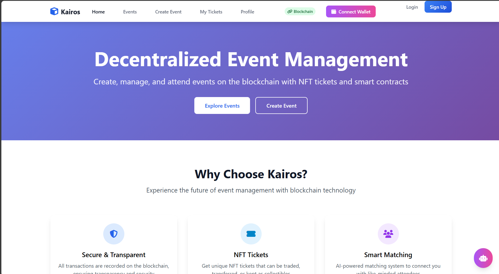

# Blockchain-Powered Event Ticketing System

---

## Problem Statement Description

Traditional event ticketing systems suffer from fraud, scalping, lack of transparency, and inefficient distribution. Our solution leverages blockchain technology to create secure, transparent, and decentralized event ticketing, ensuring fair access and eliminating intermediaries while providing immutable records of ticket ownership and transfers.

---

## Project Overview

Kairos is a comprehensive blockchain-based event management platform that revolutionizes ticketing through smart contracts. It enables event organizers to create NFT-based tickets, provides secure payment processing, and offers a seamless user experience for event discovery, ticket purchasing, and management. The platform ensures ticket authenticity, prevents fraud, and provides real-time analytics for event organizers.

---

## Architecture

- **Frontend:** HTML/CSS/JavaScript dashboard for event organizers, attendees, and administrators
- **Backend:** Flask server for authentication, event management, and blockchain integration
- **Database:** Supabase PostgreSQL for user data and event metadata
- **Blockchain:** Ethereum Sepolia testnet with custom smart contracts (EventContract, PaymentProcessor, TicketNFT)
- **AI Services:** Integrated AI agent for event recommendations and management assistance
- **Deployment:** Render (backend) and Vercel (frontend) with Infura for blockchain connectivity

---

## Tech Stack

- HTML5, CSS3, JavaScript (ES6+)
- Flask, Python 3.12.7
- Supabase PostgreSQL
- Web3.py, Solidity smart contracts
- Hardhat development framework
- OpenAI API for AI agent
- JWT for authentication
- Render, Vercel for deployment
- GitHub for version control

---

## Team Name

HackShack

---

## Team Members & Details

| Name                | Role                | Email                       | LinkedIn                        | College Name                   |
|---------------------|---------------------|-----------------------------|---------------------------------|--------------------------------|
| Pradeepto Pal     | Team Lead           | pradeepto.home@gmail.com                     | [LinkedIn](https://www.linkedin.com/in/pradeeptopal/)                      | SRM Institute of Science and Technology, Delhi-NCR                      |
| Harsh Singhal     | Blockchain Developer| harshsinghal0112@gmail.com                     | [LinkedIn](https://www.linkedin.com/in/harsh-singhal-8a5826222/)                      | SRM Institute of Science and Technology, Delhi-NCR                      |
| Meet Dobaria     | PPT Developer   | meet.dobaria22@gmail.com                     | [LinkedIn](https://www.linkedin.com/in/meet-dobaria-168725274/)                      | SRM Institute of Science and Technology, Delhi-NCR                      |
| Shivansh Agarwal     | Frontend Developer  | shivanshagarwal601@gmail.com                     | [LinkedIn](https://www.linkedin.com/in/shivansh-agarwal-61546a322)                      | SRM Institute of Science and Technology, Delhi-NCR                       |
| Deepanshu Tevathiya     | Backend Developer  | deepanshutev@gmail.com                     | [LinkedIn](https://www.linkedin.com/in/deepanshu-tevathiya/)                      | SRM Institute of Science and Technology, Delhi-NCR                      |

---

## Additional Links

- [GitHub Repository](https://github.com/PerseusKyogre09/kairos)
- [Project Demo/Video](#)
- [Deployed Frontend](https://kairos-roan.vercel.app/)
- [Smart Contracts](https://sepolia.etherscan.io/)

---

## Instructions for Evaluators

### Prerequisites
- Node.js 18+ and npm
- Python 3.12.7
- Git

### Local Setup
1. **Clone the repository:**
   ```bash
   git clone https://github.com/PerseusKyogre09/kairos.git
   cd kairos
   ```

2. **Backend Setup:**
   ```bash
   cd backend
   pip install -r requirements.txt
   cp .env.example .env
   # Edit .env with your configuration
   python app.py
   ```

3. **Frontend Setup:**
   ```bash
   cd frontend
   python -m http.server 8000
   ```

4. **Blockchain Setup:**
   ```bash
   npm install
   npx hardhat compile
   npx hardhat test
   ```

### Access Points
- Frontend: http://localhost:8000
- Backend API: http://localhost:5000
- Admin Dashboard: http://localhost:8000/dashboard.html

### Key Features to Test
- Event creation and management
- NFT ticket minting and transfer
- Payment processing with smart contracts
- User authentication and profiles
- AI-powered event recommendations

---

Thank you for your submission and participation in GenIgnite Pre-Hackathon at IPEC!

---

**Team HackShack**
<parameter name="filePath">c:\Users\palpr\Programming_Projects\Hackathon\blockchain-unstop\README.md